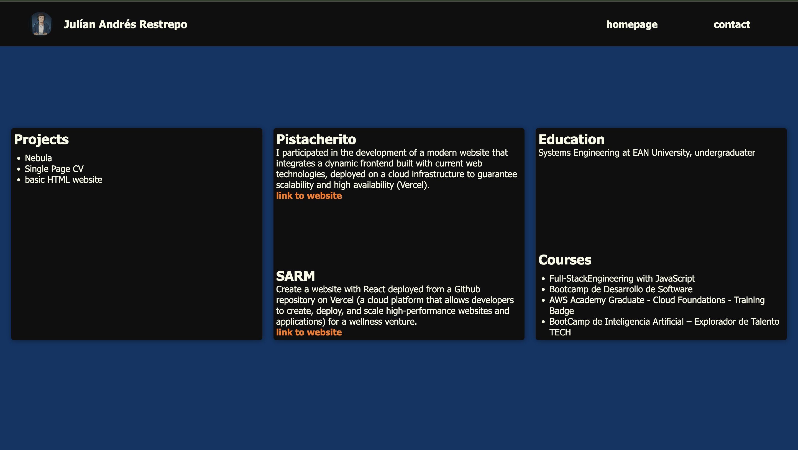
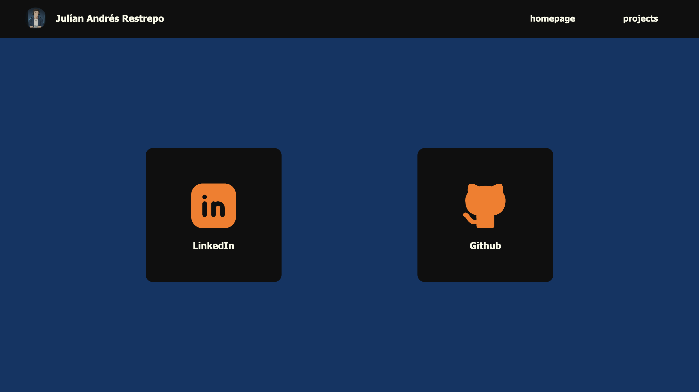

# Portafolio de Ejercicio

Este es un proyecto de **portafolio de ejercicio** desarrollado para practicar **HTML** y **CSS**. 

El objetivo principal de este proyecto es servir como un espacio de aprendizaje y práctica para mejorar las habilidades en el desarrollo web frontend, específicamente en la creación de estructuras HTML semánticas y estilos CSS.

## Descripción

Este portafolio incluye las siguientes secciones:

- **Homepage**: Página principal con información del desarrollador
- **Projects**: Sección dedicada a mostrar proyectos realizados
- **Contact**: Formulario de contacto

## Estructura del Proyecto

```
BASIC-HTML-WEBSITE/
├── index.html          # Página principal
├── pages/              # Páginas secundarias
│   ├── projects.html
│   └── contact.html
├── resources/          # Recursos del proyecto
│   ├── homepage.png
│   ├── projects.png
│   ├── contact.png
│   └── julian-animation.png
└── favicon/            # Iconos del sitio
```

## Tecnologías Utilizadas

- **HTML5**: Estructura semántica del sitio
- **CSS3**: Estilos y diseño visual

## Capturas de Pantalla

### Homepage


### Projects


### Contact


## Propósito

Este proyecto fue creado con fines educativos y de práctica. Es un ejercicio práctico para:

- Aprender y mejorar las habilidades en HTML y CSS
- Practicar la estructuración semántica de páginas web
- Desarrollar habilidades de diseño web responsive
- Comprender las mejores prácticas en desarrollo frontend

---

**Nota**: Este es un proyecto de ejercicio y práctica, no un portafolio profesional de producción.
